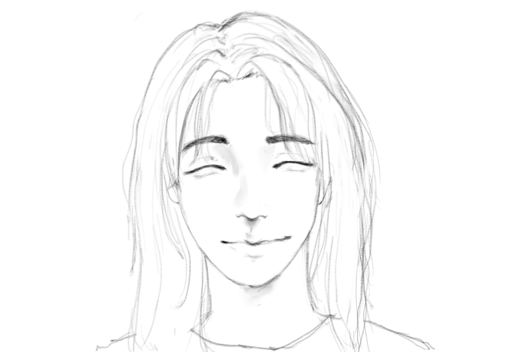

---
# Feel free to add content and custom Front Matter to this file.
# To modify the layout, see https://jekyllrb.com/docs/themes/#overriding-theme-defaults

layout: home
---

  

    
  

  

    
Hi, I'm a ph.D. student in the theory of computation group at Harvard University, where I'm fortunate to be advised by Prof. <a href="https://www.boazbarak.org">Boaz Barak</a>. I recieved by B.S. from University of Washington.
    

    
I'm broadly interested in Probability theory, Optimization, Machine learning, and Algorithms.

  

<!-- {:style="float: left"; margin-right: 10em; height="40%" width="40%"}
Hi, I'm a ph.D. student in the theory of computation group at Harvard University, where I'm fortunate to be advised by Prof. [Boaz Barak](https://www.boazbarak.org). I recieved by B.S. from University of Washington -->

<!-- I'm broadly interested in Probability theory, Optimization, Machine learning, and Algorithms.\ -->

## Papers:
[Central Limit Theorem of Overlap for the Mean Field Ghatak-Sherrington model](https://arxiv.org/abs/2312.15774)\
Yueqi Sheng, Qiang Wu (Submitted to JMP)

[Robust reconstruction of single-cell RNA-seq data with iterative gene weight updates](https://pubmed.ncbi.nlm.nih.gov/37387155/)\
Yueqi Sheng, Boaz Barak, Mor Nitzan (ISMB/EECB 2023)

[(Nearly) Efficient Algorithms for the Graph Matching Problem on Correlated Random Graphs](https://arxiv.org/abs/1805.02349)\
Boaz Barak, Chi-Ning Chou, Zhixian Lei, Tselil Schramm, Yueqi Sheng (NeurIPS 2019)	

## Teaching:
Fall 2023: (COMPSCI 121) Introduction to Computer Science \
Teaching Fellow 

Spring 2018: (COMPSCI 127) Cryptography \
Teaching Fellow

